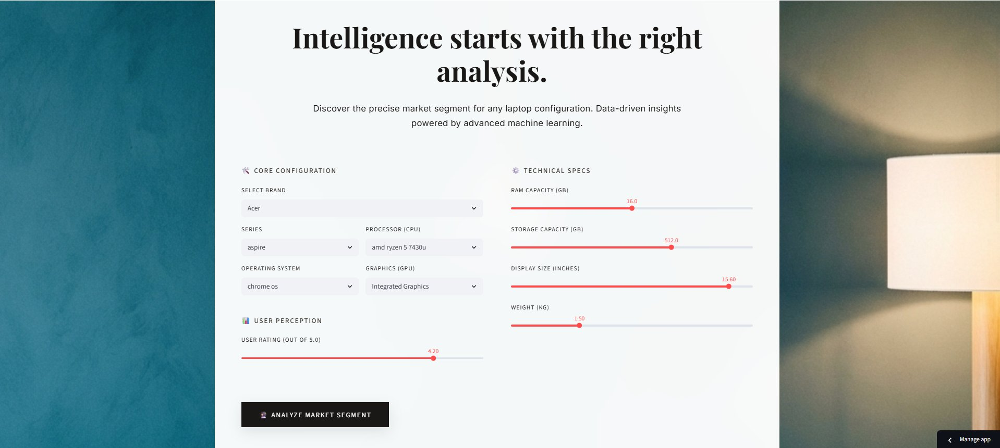

# Laptop Market Intelligence System — Price Segmentation Using ML

[](https://laptop-analysis.streamlit.app/)
[](https://python.org)

> An end-to-end data science project that scrapes real Flipkart laptop listings, performs full EDA, clusters laptops into market segments using unsupervised learning, and predicts price categories using supervised classification — all accessible via a live Streamlit web app.

**[Try the Live App →](https://laptop-analysis.streamlit.app/)**

---

## Project Overview

This project answers a real business question:

> *"Given a laptop's specs, which market segment does it belong to — and can we predict its price category automatically?"*

The pipeline goes from raw web scraping all the way to a deployed ML model, covering every step a professional data scientist would take.

---

## Pipeline Architecture

```
Flipkart Website
      │
      ▼
[1] Web Scraping         ← Webscrap_Code.py (Selenium + BeautifulSoup)
      │  ~1,100 laptops scraped across 44 pages
      ▼
[2] Data Cleaning        ← Missing values, duplicates, type correction
      │
      ▼
[3] Feature Engineering  ← RAM_GB, Storage_GB, Display_inch, Weight_kg
      │
      ▼
[4] EDA                  ← Univariate, Bivariate, Multivariate analysis
      │
      ▼
[5] MySQL Storage         ← Cleaned & clustered data stored in local DB
      │
      ▼
[6] Unsupervised ML      ← K-Means + Hierarchical Clustering + PCA
      │
      ▼
[7] Supervised ML        ← 6 models trained, best model tuned via GridSearchCV
      │
      ▼
[8] Streamlit App        ← Live at https://laptop-analysis.streamlit.app/
```

---

## Features

- Real Flipkart data scraped using Selenium and BeautifulSoup
- Full data cleaning pipeline including IQR-based outlier handling
- Feature extraction from raw text (CPU, GPU, RAM, Storage, Display, Weight, OS)
- MySQL integration for persistent data storage
- K-Means clustering with elbow method + silhouette score to find optimal k
- Hierarchical clustering (Ward linkage) with dendrogram visualization
- PCA 2D projection for cluster visualization
- 6 classification models trained and compared
- GridSearchCV hyperparameter tuning on the best model
- Deployed Streamlit app for real-time price category prediction

---

## Tech Stack

| Category | Tools |
|---|---|
| Web Scraping | Selenium, BeautifulSoup4, Pandas |
| Data Processing | Pandas, NumPy, Regex |
| Database | MySQL, SQLAlchemy |
| Visualization | Matplotlib, Seaborn |
| Unsupervised ML | Scikit-learn (KMeans, PCA), SciPy (hierarchical) |
| Supervised ML | Scikit-learn, XGBoost |
| Deployment | Streamlit, Joblib |

---

## Step-by-Step Breakdown

### Step 1 — Web Scraping (`Webscrap_Code.py`)

Scrapes Flipkart's laptop search pages using Selenium with headless Chrome.

**What it collects:**

| Field | Example |
|---|---|
| Title | ASUS VivoBook 15 Intel Core i5 |
| Brand | ASUS |
| CPU | Intel Core i5 12th Gen |
| GPU | Intel Iris Xe |
| RAM | 16 GB |
| Storage | 512 GB SSD |
| Display | 15.6 inch |
| Price (Rs) | 54990 |
| Original Price (Rs) | 67990 |
| Discount % | 19% |
| Rating | 4.2 |
| Review Count | 1,234 |

- Covers **44 listing pages** for up to **1,100 laptops**
- Pre-compiled regex patterns extract CPU/GPU from unstructured spec text
- Smart optimization: skips product page if GPU + Price already found in listing (20x faster)
- Handles Flipkart's dynamic loading with safe scrolling and retries

---

### Step 2 — Data Cleaning

- Standardizes missing-like strings (`NA`, `null`, `N/A`, blank) → `NaN`
- Drops rows missing critical fields: Brand and Price
- Removes duplicates
- Standardizes Brand to title case (e.g., `hp` → `Hp`)

---

### Step 3 — Data Type Correction

- Strips non-numeric characters from Price and Original Price columns
- Converts to float for arithmetic operations
- Handles edge cases like `₹` symbols and comma separators

---

### Step 4 — Missing Values & Outlier Detection

- Prints full missing value summary per column
- IQR-based outlier detection across: `Price(Rs)`, `Original Price(Rs)`, `Discount Percentage`, `Rating`, `Review Count`
- Boxplots generated before and after handling to visualize impact

---

### Step 5 — Outlier Handling

- IQR capping: values below `Q1 - 1.5×IQR` or above `Q3 + 1.5×IQR` are clipped
- Preserves data size while reducing distortion from extreme values

---

### Step 6 — Feature Engineering

Extracts numeric values from raw text fields:

| New Feature | Source | Example |
|---|---|---|
| `RAM_GB` | "16 GB" | 16.0 |
| `Storage_GB` | "1 TB SSD" | 1024.0 |
| `Display_inch` | "15.6 inch" | 15.6 |
| `Weight_kg` | "1.8 kg" | 1.8 |

- Storage normalized to GB (1 TB = 1024 GB)

---

### Step 7 — EDA

**Univariate:** Price distribution — most laptops cluster in lower price ranges, confirming a price-sensitive market.

**Bivariate:** Price vs Rating — higher price does not strongly improve ratings; customer satisfaction is relatively uniform.

**Multivariate:** Brand × RAM × Price — premium brands (Apple, MSI) position with higher memory and pricing, showing clear strategic differentiation.

---

### Step 8 — MySQL Integration

Cleaned data is loaded into a local MySQL database (`flipkart_laptops_db`) using SQLAlchemy for persistent storage and reuse across notebooks.

Tables created:
- `laptops_cleaned` — cleaned and feature-engineered dataset
- `flipkart_laptops_clustered` — with cluster labels added

---

### Step 9 — Unsupervised Learning

**K-Means Clustering**
- Tested k = 2 to 10
- Optimal k selected using both **elbow method** (inertia) and **silhouette score**
- Final cluster labels saved back to MySQL

**PCA Visualization**
- 2-component PCA used to project high-dimensional clusters into 2D scatter plot
- Cluster separation visually confirmed

**Hierarchical Clustering**
- Ward linkage method with dendrogram
- `fcluster` used to cut tree at same k as K-Means

**Comparison**
- K-Means vs Hierarchical cluster assignments compared row-by-row

---

### Step 10 — Supervised Learning (Price Category Prediction)

**Target Variable — Price Category:**

| Category | Price Range |
|---|---|
| Low | < ₹40,000 |
| Medium | ₹40,000 – ₹60,000 |
| High | ₹60,000 – ₹90,000 |
| Premium | > ₹90,000 |

**Models Trained & Results:**

| Model | Test Accuracy | CV Accuracy (5-fold) |
|---|---|---|
| Logistic Regression | 73.10% | 75.34% |
| Decision Tree | 73.79% | 77.24% |
| Random Forest | 80.00% | 82.24% |
| SVC | 68.97% | 78.10% |
| KNN | 72.41% | 76.38% |
| Gradient Boosting | 84.14% | 81.55% |
| **Gradient Boosting (Tuned)** | **80.69%** | **83.28%** |

> Best params from GridSearchCV: `learning_rate=0.1`, `max_depth=5`, `n_estimators=200`, `min_samples_split=2`

**Classification Report (Tuned Model):**

| Price Category | Precision | Recall | F1-Score |
|---|---|---|---|
| Low (< ₹40K) | 0.87 | 0.82 | 0.85 |
| Medium (₹40K–₹60K) | 0.80 | 0.80 | 0.80 |
| High (₹60K–₹90K) | 0.75 | 0.82 | 0.78 |
| Premium (> ₹90K) | 0.83 | 0.77 | 0.80 |
| **Overall Accuracy** | | | **81%** |

**Evaluation:** Confusion matrix + full classification report (precision, recall, F1) per price category. Goal of >80% accuracy achieved.

**Saved Artifacts:**
- `best_laptop_price_model.pkl`
- `scaler.pkl`
- `target_encoder.pkl`

---

## Project Structure

```
laptop-price-segmentation-predictor/
│
├── Laptop Market Analysis/
│   ├── Webscrap_Code.py                           ← Flipkart scraper
│   ├── EDA_flipkart_laptop_EDA__UnSupervised_.ipynb   ← EDA + Clustering (Steps 1–9)
│   ├── EDA_flipkart_laptop_supervised_.ipynb      ← Classification models (Step 10)
│   ├── app.py                                     ← Streamlit web app
│   ├── best_laptop_price_model.pkl                ← Saved best model
│   ├── scaler.pkl                                 ← Feature scaler
│   └── target_encoder.pkl                         ← Label encoder
│
├── requirements.txt                               ← Python dependencies
└── README.md
```

---

## How to Run Locally

### 1. Clone the repo
```bash
git clone https://github.com/KrishnaJ4F/laptop-price-segmentation-predictor.git
cd laptop-price-segmentation-predictor
```

### 2. Install dependencies
```bash
pip install -r requirements.txt
```

### 3. (Optional) Re-scrape data
```bash
python Webscrap_Code.py
```
> Requires Chrome + ChromeDriver installed. Saves to `laptop.csv`.

### 4. Run the Streamlit app
```bash
streamlit run app.py
```

---

## Requirements

```
streamlit
pandas
numpy
scikit-learn
xgboost
matplotlib
seaborn
selenium
beautifulsoup4
sqlalchemy
pymysql
joblib
scipy
```

---

## Dataset

- **Source:** Flipkart laptop listings (scraped live)
- **Pages scraped:** 44 pages
- **Raw records:** ~1,100 laptops
- **After cleaning:** ~980 laptops (duplicates and missing Brand/Price removed)
- **Features:** 17 columns including Title, Brand, CPU, GPU, RAM, Storage, Display, Weight, OS, Price, Original Price, Discount %, Rating, Review Count

---

## App Screenshots

**Input Panel — Configure laptop specs and trigger prediction**


**Output Panel — Suggested market segment with detailed analysis**


---

## Live Demo

**[https://laptop-analysis.streamlit.app/](https://laptop-analysis.streamlit.app/)**

---

## Key Insights

- Budget segment (< ₹40K) dominates Flipkart listings — most laptops are price-sensitive
- Higher price does not correlate strongly with rating — customer satisfaction is relatively uniform
- Premium brands (Apple, MSI) clearly differentiate on RAM and display quality
- Gradient Boosting outperformed all models with **84.14% test accuracy** before tuning
- After GridSearchCV tuning, the model achieves **81% overall accuracy** with strong F1 scores across all 4 price categories
- Low-priced laptops are the easiest to classify (F1: 0.85); High-priced (₹60K–₹90K) is the hardest (F1: 0.78)
- Clustering reveals distinct market tiers that align closely with manual price category boundaries
- Dataset: 984 raw records → 725 used for ML after feature engineering and null removal

---

## Author

**Krishna Kumar** — [@KrishnaJ4F](https://github.com/KrishnaJ4F)

---

## Disclaimer

This project is for educational purposes only. Flipkart data was scraped for academic/portfolio use. Not intended for commercial use.
